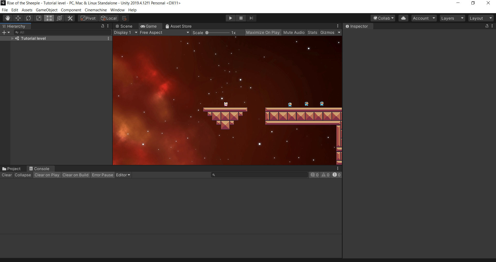

# Rise of the Sheeple Overview
This is a basic game developed with Unity. It is a sidescrolling 2D platformer with baisc playability and functionality. 
The goal of the player is to collect "sheep" and reach the end of the level.

Pending Implementations:
* Enemies
* Logic Puzzles
* Multiple Levels
* Storyline
* End Game Condition
* Start Game Condition
* Menu's
* Level Progression

In its current state the character can move around a basic tutorial type level and collect sheep while exploring the movement of the character.

# Development Environment
* Visual Studio Code  
* Unity 2019.4.12f1
* Unity Hub 2.4.1
* GitHub Desktop 2.6.0

# Execution
Download the project file. Make sure that you are using the correct version of Unity. We did most of our collaboration using GitHub Desktop.
Once the repo is pulled, you can open it in Unity Hub and from there you can bring it up in Unity. Curerntly, there is not an executable file.

# Useful Websites

1. [GitHub Desktop Documentation](https://docs.github.com/en/free-pro-team@latest/desktop)
2. [Unity Documentation](https://docs.unity3d.com/Manual/index.html)
3. [Excellent Youtube Resource for Unity](https://www.youtube.com/channel/UCYbK_tjZ2OrIZFBvU6CCMiA)
